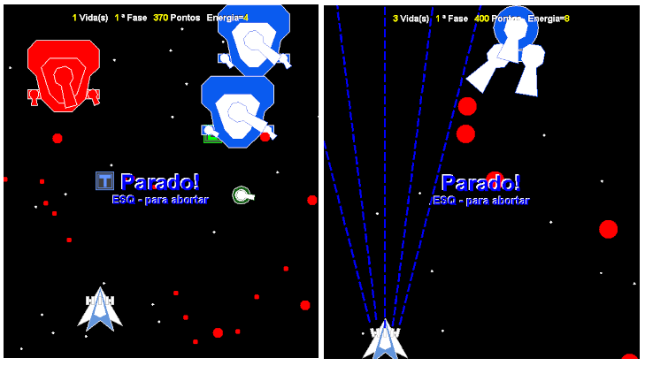

# Jogo de batalha estrelar

Veja abaixo uma captura de tela do jogo em execução:



Para rodar o jogo, basta baixar o arquivo BE-1.2.jar e rodar executando o seguinte comando:

```
java -jar BE-1.2.jar
```

Obs, para funcionar depende do java 1.8 ou superior instalado na máquina
